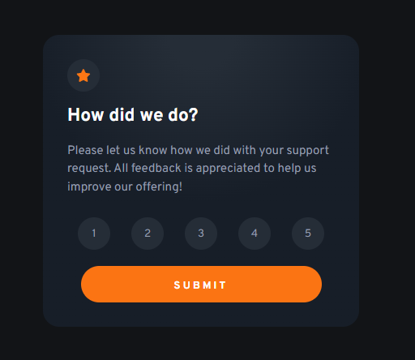
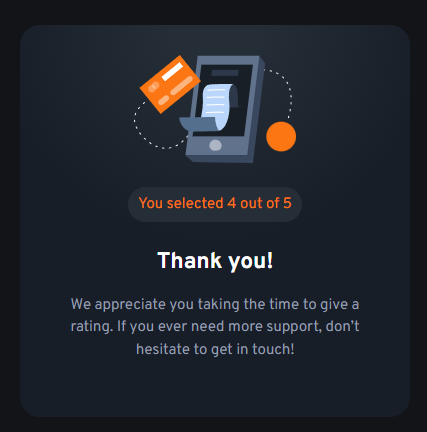

# Frontend Mentor - Interactive rating component solution

This is a solution to the [Interactive rating component challenge on Frontend Mentor](https://www.frontendmentor.io/challenges/interactive-rating-component-koxpeBUmI). Frontend Mentor challenges help you improve your coding skills by building realistic projects. 

## Table of Contents

- [Overview](#overview)
  - [The challenge](#the-challenge)
  - [Screenshot](#screenshot)
  - [Links](#links)
- [My process](#my-process)
  - [Built with](#built-with)
  - [What I learned](#what-i-learned)
  - [Useful resources](#useful-resources)
- [Author](#author)

## Overview

### The challenge

Users should be able to:

- View the optimal layout for the app depending on their device's screen size
- See hover states for all interactive elements on the page
- Select and submit a number rating
- See the "Thank you" card state after submitting a rating

### Screenshot




### Links

- Solution URL: [Rating Component Solution](https://your-solution-url.com)
- Live Site URL: [Rating Component Challenge](https://rating-component-challenge.netlify.app)

## My process


### Built with

- Semantic HTML5 markup
- CSS
- JavaScript
- Mobile-first workflow

### What I learned

- In the challenge when you click one of the buttons labeled 1-5, You need to apply the style to the button that was clicked and the sibling to the left I did this with JavaScript.
```js
buttons.forEach((button, i) => {
    button.addEventListener('click', () => {
        removeState()
        button.classList.add('orange')
        if(buttons[i - 1]) {
            buttons[i - 1].classList.toggle('prev-hover')
        }
    })
})
```
- I also learned how to make a cool looking wave animation for the buttons when clicked. I accomplished this by using keyframes.

```css
button.orange,
button.prev-hover {
    overflow: hidden;
    position: relative;
    color: white;
    z-index: 1;
}

.orange::before,
.prev-hover::before {
    content: "";
    z-index: -1;
    left: -50%;
    top: -50%;
    position: absolute;
    background-color: orange;
    width: 90px;
    height: 90px;
    border-radius: 20px;
    animation: wave 2s linear;
}

@keyframes wave {
    0% {
        top: 100%;
        left: -50%;
    }

    100% {
        top: -50%;
        transform: rotate(360deg);
    }
}
```

- I also learned how to get the item in the previous index in a forEach loop
```js
buttons.forEach((button, i) => {
    button.addEventListener('click', () => {
        removeState()
        button.classList.add('orange')
        if(buttons[i - 1]) {
            buttons[i - 1].classList.toggle('prev-hover')
        }
    })
})
```

### Useful resources
[forEach Resource](https://www.w3schools.com/jsref/jsref_forEach.asp) Had to use this resource because i couldn't figure out how to get the previous element in the array for the life of me.

## Author
- Frontend Mentor - [@Nathan](https://www.frontendmentor.io/profile/yourusername)
- Twitter - [@BurritoLinguini](https://www.twitter.com/BurritoLinguini)
